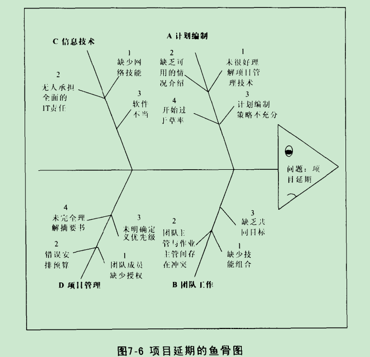
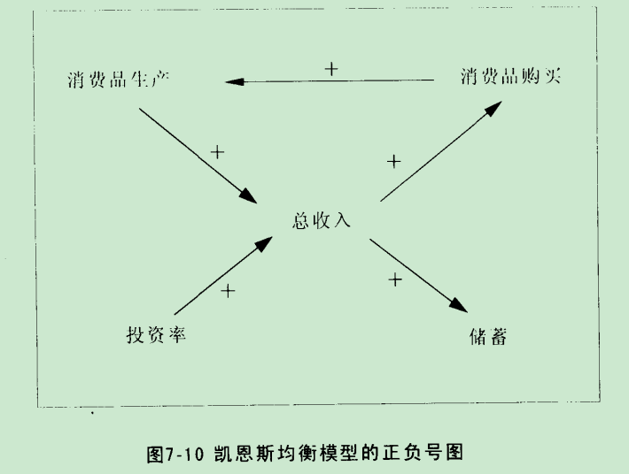

### 图示业务

系统布局图

韦恩图

### 关系和影响

《哲学与生活》联系的观点看待问题。

树形图由关系图延伸而来。

TODO  目的与目标

企业组织结构、家族结构
家谱

### 影响图

与树形组织图的结合。

### 输入输出图

控制图

//控制论

### 因果关系的思考

多重原因图

**鱼骨图**

todo  每一种图的优缺点、适用场合

鱼骨图缺乏多重原因图所具有的整体观和动态观。

正负号图

因果关系影响的数量关系。
